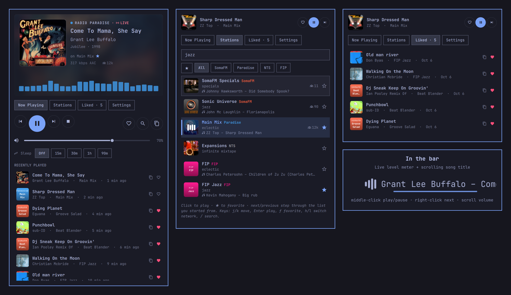

# Airwaves (grivera.airwaves)

Ad-free internet radio for the Omarchy bar. Airwaves has 80 stations from broadcasters that are listener-supported and play no commercials. A live visualizer and the current song sit right in your bar.



| Network | Stations | Now playing | Cover art |
| --- | --- | --- | --- |
| [SomaFM](https://somafm.com) | 46 hand-programmed channels (Groove Salad, Drone Zone, Secret Agent, …) | stream metadata | looked up on iTunes |
| [Radio Paradise](https://radioparadise.com) | Main, Mellow, Rock, Global, Beyond…, Serenity, KFAT | stream + API | from Radio Paradise |
| [NTS](https://www.nts.live) | NTS 1 and NTS 2 live, plus 16 Infinite Mixtapes | live show, genres, what's next | show artwork |
| [FIP](https://www.radiofrance.fr/fip) | FIP plus Rock, Jazz, Groove, Monde, Nouveautés, Reggae, Electro, Metal | Radio France live metadata | from FIP |

You can add any other Icecast or Shoutcast stream under **Settings → Your stations**.

## Install

Use Omarchy's plugin manager:

```
omarchy plugin add https://github.com/grivera82/omarchy-airwaves.git --enable
```

This clones the plugin into `~/.config/omarchy/plugins/grivera.airwaves`, checks it, and adds the widget to your bar. When run interactively, it asks which bar section to use (default: right). Without `--enable`, you can turn it on later with:

```
omarchy plugin enable grivera.airwaves --section right
```

There's no account, API key or setup. Click the radio icon and press play.

To update or uninstall:

```
omarchy plugin update grivera.airwaves
omarchy plugin disable grivera.airwaves   # hide it but keep it installed
~/.config/omarchy/plugins/grivera.airwaves/bin/airwaves stop   # turn the radio off before removing
omarchy plugin remove grivera.airwaves    # delete it
rm -rf ~/.cache/grivera-airwaves ~/.local/state/grivera-airwaves ~/.config/grivera-airwaves   # optional: cache, settings, likes, your stations
```

mpv runs as its own process so music survives shell reloads, which is why the radio should be stopped before removing the plugin. If you forget, stop it from the media controls.

Airwaves never touches your Omarchy or Hyprland configuration. It writes only to the folders listed under [Files](#files).

## What it does

- **In the bar:** four level bars that move with the actual audio (mpv's `astats` filter, about 20 updates a second), followed by the song title, which scrolls when it doesn't fit. Middle-click plays or pauses, right-click skips to the next station, and scrolling changes the volume.
- **Now Playing:** cover art over a blurred backdrop, a 24-band visualizer, artist, album and year, bitrate and listener count, play/pause/next/previous/stop, volume, a sleep timer that fades out over its last 30 seconds, and recently played songs.
- **Stations:** search across station names, genres and the songs on air right now. Filter by network or ★ favorites. Each row shows what's playing.
- **Liked songs:** click the heart (or press `L`, or run `airwaves like` from a keybinding) to save a song. Find it later on YouTube Music, Spotify or Apple Music, or copy it.
- **Next/previous** step through the list you started from: your favorites if the station is one, otherwise its network.
- **Notifications** (optional): a notification on each new song, with a **♥ Like** button. They go straight to the notification server over D-Bus, so song text never appears on a command line.
- **Media keys and OSD:** mpv runs with mpv-mpris, so the standard play/pause and next/previous keys work, and the Omarchy media OSD shows song changes. For FIP and NTS, Airwaves fills in the song or show name itself.
- **Keeps playing through shell reloads:** mpv runs detached, and the daemon reconnects to it.
- **Resume after login** (optional): if the radio was on when you logged out, it comes back on.
- **Support links:** each network's page has a button to support it. These stations exist because listeners pay for them.

## Requirements

- `mpv` (the `mpv` package)
- `mpv-mpris` for media keys (the `mpv-mpris` package, if it isn't installed yet)
- Python 3 (standard library only)
- Optional: `wl-copy` (wl-clipboard) for Copy, and `xdg-open` or Omarchy's `omarchy-launch-webapp` to open search links and support pages. Omarchy includes both.
- Network access to the stations' streams and APIs: `somafm.com`, `radioparadise.com`, `nts.live`, `radiofrance.fr`, plus `itunes.apple.com` if album art lookup is on. No account or key is needed. Airwaves isn't affiliated with any of these broadcasters.

## Keys

Panel: `1`–`4` switch tabs, `Space` plays or pauses, `h`/`l` change station (Now Playing) or network (Stations), `j`/`k` move through stations, `Enter` plays, `f` adds a favorite, `L` likes the song, `+`/`-` change volume, `m` mutes, `s` stops, `/` searches.

## Command line and keybindings

```
airwaves status [--json]
airwaves toggle | stop | next | prev | mute
airwaves play [station name]      # e.g. airwaves play drone zone
airwaves like
airwaves volume +5 | -5 | 40
airwaves sleep 30 | off
airwaves stations
```

The CLI is `~/.config/omarchy/plugins/grivera.airwaves/bin/airwaves`. Example bindings for `~/.config/hypr/bindings.lua`:

```lua
o.bind("SUPER + ALT + R", "Radio play/pause", "~/.config/omarchy/plugins/grivera.airwaves/bin/airwaves toggle")
o.bind("SUPER + ALT + L", "Like this song", "~/.config/omarchy/plugins/grivera.airwaves/bin/airwaves like")
```

## Status for scripts and voice assistants

`omarchy-shell grivera.airwaves status` prints a JSON summary: what's playing, the station, volume, sleep timer, recent songs and favorite stations. Voice assistants such as [Jarvis](https://github.com/grivera82/omarchy-jarvis) use it to answer questions. It only reads, and works while the widget is in the bar.

## Your own stations

Use **Settings → Your stations**, or edit `~/.config/grivera-airwaves/stations.json` directly:

```json
[
  { "name": "WFMU", "url": "https://stream0.wfmu.org/freeform-128k", "genre": "freeform", "image": "https://…/logo.png" }
]
```

## Files

- `~/.local/state/grivera-airwaves/`: settings, favorites, liked songs, history
- `~/.cache/grivera-airwaves/`: station list and cover art
- `$XDG_RUNTIME_DIR/grivera-airwaves/`: mpv and control sockets

## Privacy

Airwaves contacts only the stations' own servers and APIs. With **Find album art** on, it also sends the artist and title of the current SomaFM or custom-station song to Apple's public iTunes Search API to fetch a cover. It sends nothing else anywhere.

## License

MIT
